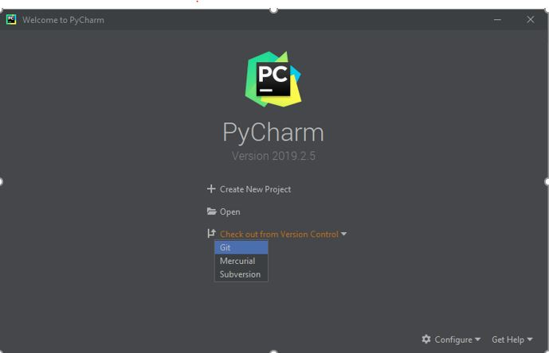
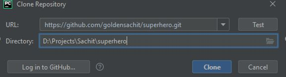
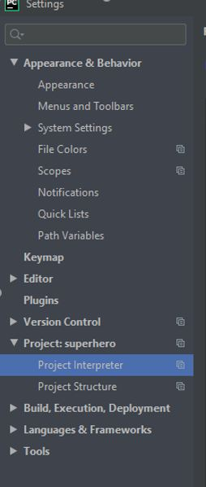

# Download and Run the program on your local machine using PyCharm

Linux users : 

if you are running this program on linux, ensure you have python tkinter install already. Use below command to install tkinter

sudo apt-get install python3-tk

***

Open PyCharm. Below screen should loads up

Click on the GIT option shown in above. 
***

Following pop-up will show up

put below URL  in above screenshot

https://github.com/goldensachit/superhero.git
***

After clicking on the Clone button below popup will show up. Click on Yes button

***

Once project loads up press _Ctrl+Alt+S_ to open the project Settings/Preferences. 

Navigate to below option 

***

